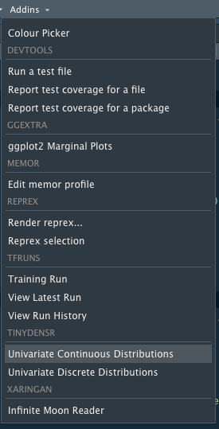
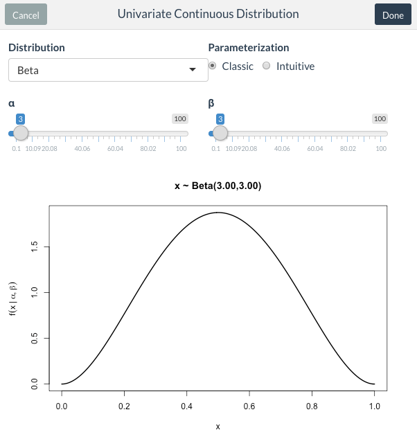
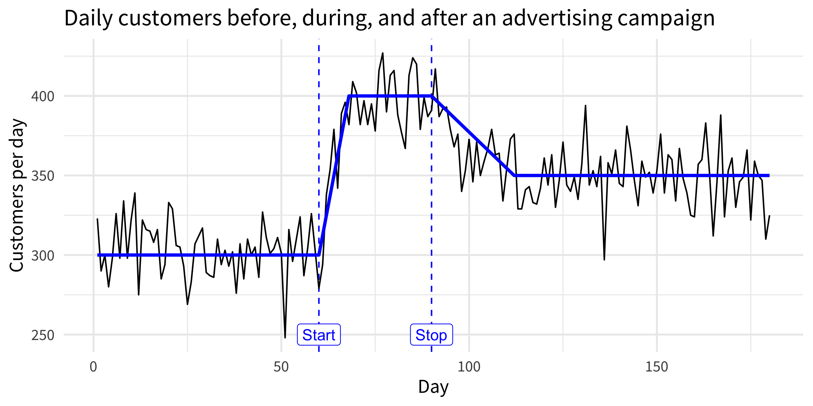
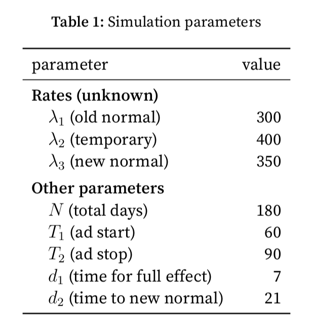
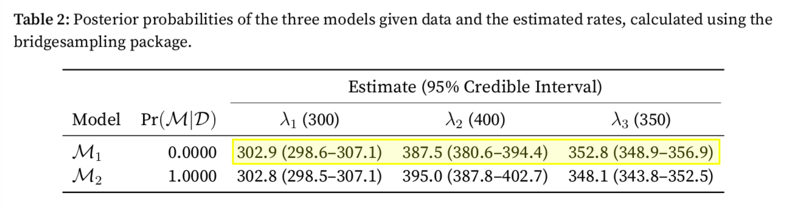
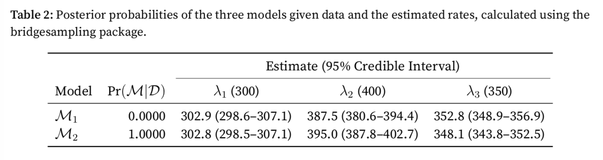
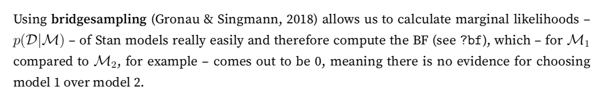
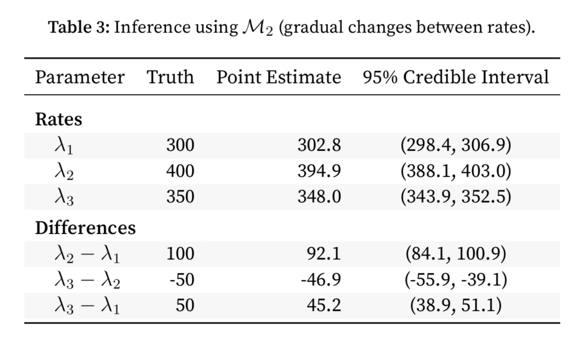

---
output:
  xaringan::moon_reader:
    chakra: libs/remark-latest.min.js
    css: [default, default-fonts, custom.css]
    seal: false
    lib_dir: libs
    nature:
      highlightStyle: github
      highlightLines: true
      countIncrementalSlides: false
      beforeInit: "macros.js"
    df_print: tibble
---

```{r setup, include=FALSE}
options(
  htmltools.dir.version = FALSE,
  knitr.table.format = "html"
)
knitr::opts_chunk$set(warning = FALSE, message = FALSE)
```

class: title-slide, bottom

# A Workflow For Bayesian Modeling and Reporting in R

<br>

### Mikhail Popov

<br><br>

`r icon::fa("envelope")` mikhail @ mpopov.com / wikimedia.org

`r icon::fa("twitter")` [bearloga](https://twitter.com/bearloga)

`r icon::fa("github")` [bearloga](https://github.com/bearloga)

`r icon::fa("wikipedia-w")` [[[User:MPopov (WMF)]]](https://en.wikipedia.org/wiki%2fUser%3aMPopov_%28WMF%29)

`r icon::fa("code")` [github.com/bearloga/pittsburgh-user-bayesian-2018](https://github.com/bearloga/pittsburgh-user-bayesian-2018)

---

# Disclaimers

## What this talk isn't

- A lesson in Bayesian statistics and probability theory
    - [Bayesian Basics](https://m-clark.github.io/bayesian-basics/) by Michael Clark (free introduction)
    - [Bayesian Methods for Hackers](http://camdavidsonpilon.github.io/Probabilistic-Programming-and-Bayesian-Methods-for-Hackers/) by Cam Davidson-Pilon (notebooks)
    - [Statistical Rethinking](http://xcelab.net/rm/statistical-rethinking/) by Richard McElreath (book)
- An attempt to convince anyone to use Bayesian inference

## What this talk is

- A brief lesson in using tidyverse in your workflow
- Tips for Bayesian modeling with Stan in R
- Suggestions for nice presentation with R Markdown

---

# Packages

## Essentials

- `tidyverse` (especially `dplyr`, `tidyr`, `purrr`,` broom`)
- `rstan` for modelling
- `bridgesampling` for model comparison
- `kableExtra` for table formatting
- `rmarkdown` for final output

## Suggestions

- [`memor`](https://hebrewseniorlife.github.io/memor/) for a customizable template, which [`wmfpar`](https://github.com/bearloga/wmf-product-analytics-report/) is based on
- [`tinytex`](https://yihui.name/tinytex/) for LaTeX installation

---

# Brief intro to tidyverse

- `%>%` (from **magrittr**) is used to pipe `data.frame`s/`tibble`s to functions

- **purrr** enhances functional programming in R
  - `map()`, `map2()`, and `pmap()` iterate over 1, 2, or multiple lists/vector
    - if using a formula, `.x` refers to element from first argument
  - all functions are type-stable
    - `map()` returns a list
    - `map_dbl()`/`map_int()` return numeric/integer vectors
    - `map_chr()`/`map_lgl()` return character/logical vectors
    - `map_df()` returns a data frame

- **dplyr** provides many data-manipulating verbs
  - in `mutate()` you define columns (possibly from other columns)
  - `group_by()` groups rows of a data frame
  - `tally()` is a compact version of `summarize(n = n())` (after grouping)

---

# Example

```{r}
library(tidyverse)

(example <- list(a = 1:4, b = 3:7, c = 4:12))
{{ purrr::map_int(example, length) }}
```

---

```{r}
months <- example %>%
  map_dfr(~ data_frame(month = .x), .id = "component") %>%
  group_by(component) %>%
  summarize(earliest = min(month), latest = max(month))
months
months %>%
  mutate_if(is.double, ~ map_chr(month.name[.x], toupper)) %>%
  gather(which, month, -component)
```

---

# Probabilistic programming overview

With probabilistic programming languages (PPLs) you
- Write any generative probabilistic model as a program
- Use algorithms like [MCMC](https://en.wikipedia.org/wiki/Markov_chain_Monte_Carlo) and [VI](https://en.wikipedia.org/wiki/Variational_Bayesian_methods) to draw samples from posterior

PPLs recommended for R users:
- BUGS and [JAGS](http://mcmc-jags.sourceforge.net/) via rjags interface
- [Stan](http://mc-stan.org/) via RStan interface (also has a Python interface PyStan)
- [greta](https://greta-stats.org/) is a PPL in R, powered by TensorFlow

PPLs recommended for Python users:
- [PyMC3](https://docs.pymc.io/) (uses Theano as backend)
- [Edward2](https://github.com/tensorflow/probability/tree/master/tensorflow_probability/python/edward2), included in [TensorFlow Probability](https://www.tensorflow.org/probability/)
- [Pyro](http://pyro.ai/) (uses [PyTorch](https://pytorch.org/) as backend)

PPL recommended for C# and F# users: [Infer.NET](https://dotnet.github.io/infer/)

---

# Probabilistic programming example

**Goal**: estimate a coin's hidden probability after observing outcome of flips

.small[
```{r model}
library(greta)

x <- rbinom(10, 1, 0.8) # flips a very unfair coin 10 times

theta <- beta(3, 3) # creates a variable following a beta distribution

y <- as_data(x) # creates greta data array
distribution(y) <- binomial(1, theta) # specifies likelihood

m <- model(theta) # creates a greta model object
```
]

`plot(m)` produces a visual representation:

```{r representation, out.width='100%', fig.height=2, dev='svg', eval=require('DiagrammeR'), echo=FALSE}
plot(m, colour = "black")
# widgetframe::frameWidget(p)
```

---

# Priors

**tinydensR** can be used to play around with probability distributions and their parameters in RStudio IDE, which is especially useful for picking priors:

```R
# install.packages("devtools")
devtools::install_github("bearloga/tinydensR")
```

.left-column[]

.right-column[.center[]]

---

Once we have a model, we can perform statistical inference:

```{r mcmc, cache=TRUE, message=TRUE}
draws <- mcmc(m, verbose = FALSE) # performs inference
```
```{r posterior, out.width='100%', fig.width=8, fig.height=4, dev='svg'}
bayesplot::mcmc_dens(draws) # plots posterior of theta
```

---

# Case study: advertisement campaign

.pull-left[.center[]]

.pull-right[
- We manage a store
- We get 300 customers/day on average
- We run an ad for 30 days to increase business
- Ad takes a few days to yield full effect
- Afterward there's a gradual change to new normal
]

<br><br>

.center[.large[**What were the short-term and long-term effects of the ad?**]]

.footnote[For simulation code, see [report.Rmd#L84-L121](https://github.com/bearloga/pittsburgh-user-bayesian-2018/blob/master/report.Rmd#L84-L121)]

---

# Table formatting example

.left-column[]

.right-column[.smaller[
```R
data_frame(
   parameter = c(
    "$\\lambda_1$ (old normal)",
    ⋮
    "$N$ (total days)",
    ⋮
    "$d_2$ (time to new normal)"
  ),
  value = c(
    lambda_1, lambda_2, lambda_3, total_days,
    change_point_1, change_point_2,
    transition_period_1, transition_period_2
  )
) %>%
  kable(
    escape = FALSE, booktabs = TRUE,
    caption = "Simulation parameters"
  ) %>%
  # extra formatting with kableExtra:
  kable_styling(latex_options = "hold_position") %>%
  group_rows(index = c("Rates (unknown)" = 3,
                       "Other parameters" = 5))
```
]]

---

# Model specification in Stan

.small[
```Stan
data {
  int<lower=0> N; // number of observations
  int y[N];       // observed data
  real T[2];      // changepoint days
}
parameters {
  real<lower=0> lambda[3];
}
model {
  lambda ~ normal(300, 100); // prior
  for (i in 1:N) {
    if (i > T[1]) {
      if (i <= T[2]) {
        y[i] ~ poisson(lambda[2]); // likelihood during ad
      } else {
        y[i] ~ poisson(lambda[3]); // likelihood after ad
      }
    } else {
      y[i] ~ poisson(lambda[1]);   // likelihood pre-ad
    }
  }
}
```
]

---

# Model inference with RStan

```R
library(rstan)

models <- list(
  model_1 = stan_model("models/model_1.stan", "immediate"),
  model_2 = stan_model("models/model_2.stan", "gradual")
)
```

`stan_model()` translates the model spec to C++ and then compiles it into an executable which is used for inference with `sampling()` (if `data` is provided):

```R
data <- list(
  N = total_days, y = customers$customers,
  T = c(change_point_1, change_point_2),
  d = c(transition_period_1, transition_period_2)
)

draws <- map(models, sampling, data = data, refresh = 0)
```

.footnote[**Note**: if each model required a different dataset, we can have a "datas" list and use `map2(models, datas, sampling)` to iterate through each model-data combination]

---

# Model comparison



```R
extract_ci = function(draws, ...) {
  extracted_ci <- draws %>%
    tidyMCMC(pars = "lambda", conf.int = TRUE, ...) %>%
    rename(est = estimate) %>%
    mutate(est = sprintf("%.1f (%.1f--%.1f)", est,
                         conf.low, conf.high)) %>%
    select(term, est) %>%
    spread(term, est)
  return(extracted_ci)
}
```

---

`bridgesampling::bridge_sampler` calculates marginal likelihood $p(\mathcal{D}|\mathcal{M})$\* and is best used with `stanfit` models

```R
library(bridgesampling)

bridge_samples <- map(draws, bridge_sampler, silent = TRUE)
```

```R
posterior_probabilities <- data_frame(
  model = names(bridge_samples),
  post_prob = post_prob(map_dbl(bridge_samples, logml))
)
```

**Note**: `post_prob` also accepts a `prior_prob` argument (by default all models are equally likely a priori)

```R
extracted_cis <- map_dfr(draws, extract_ci, .id = "model")
```

.footnote[\[\*\] well, technically `bridge_sampler` computes the log marginal likelihood]

---

.center[]

.small[
```R
posterior_probabilities %>%
  left_join(extracted_cis, by = "model") %>%
  mutate(
    post_prob = sprintf("%.4f", post_prob),
    model = sub("model_([1-3])", "$\\\\mathcal{M}_\\1$", model),
  ) %>%
  kable(
    col.names = c("Model", "$\\text{Pr}(\\mathcal{M}|\\mathcal{D})$",
                  sprintf("$\\lambda_%i$ (%.0f)", 1:3,
                          c(lambda_1, lambda_2, lambda_3))),
    booktabs = TRUE, escape = FALSE, align = c("l", "r", "c", "c", "c")
  ) %>%
  kable_styling(latex_options = c("hold_position")) %>%
  add_header_above(header = c(" " = 2,
                              "Estimate (95% Credible Interval)" = 3))
```
]

---

# Inline Bayes factor

From the example report:



Made with inline R code in R Markdown:

.small[
```
Using **bridgesampling** [@bridgesampling] allows us to calculate
marginal likelihoods -- $p(\mathcal{D}|\mathcal{M})$ -- of Stan
models really easily and therefore compute the BF (see `?bf`),
which -- for $\mathcal{M}_1$ compared to $\mathcal{M}_2$, for
example -- comes out to be `r
round(bayes_factor(bridge_samples$model_1, bridge_samples$model_2)$bf, 2)`,
meaning there is no evidence for choosing model 1 over model 2.
```
]

---

# Presentation of results

.pull-left[
.bold[.tiny[
```R
prepared_table <- draws$model_2 %>%
  tidyMCMC(
    pars = c(
      "lambda", "diff21",
      "diff32", "diff31"
    ),
    estimate.method = "median",
    conf.int = TRUE,
    conf.method = "HPDinterval"
  ) %>%
  mutate(
    term = c(
      paste0("$\\lambda_", 1:3, "$"),
      "$\\lambda_2 - \\lambda_1$",
      "$\\lambda_3 - \\lambda_2$",
      "$\\lambda_3 - \\lambda_1$"
    ),
    truth = c(lambda_1, lambda_2,
              lambda_3, differences),
    conf.int = sprintf("(%.1f, %.1f)",
                       conf.low, conf.high)
  ) %>%
  select(term, truth, estimate, conf.int)
```
]]
]

.pull-right[


.bold[.tiny[
```R
kable(prepared_table,
      escape = FALSE, booktabs = TRUE,
      digits = 1, align = c("l", "r", "r", "c"),
      col.names = c(
       "Parameter", "Truth", "Point Estimate",
       "95\\% Credible Interval"),
      caption = "Inference using $\\mathcal{M}_2$.") %>%
  kable_styling(
    latex_options = c("striped", "hold_position")
  ) %>%
  group_rows(index = c("Rates" = 3,
                       "Differences" = 3))
```
]]
]

---
class: center, middle

# Thank you

Questions? mikhail @ mpopov.com / wikimedia.org

<br>

Source code: [github.com/bearloga/pittsburgh-user-bayesian-2018](https://github.com/bearloga/pittsburgh-user-bayesian-2018)

Slides created with [rmarkdown](https://rmarkdown.rstudio.com/) & [xaringan](https://github.com/yihui/xaringan)
